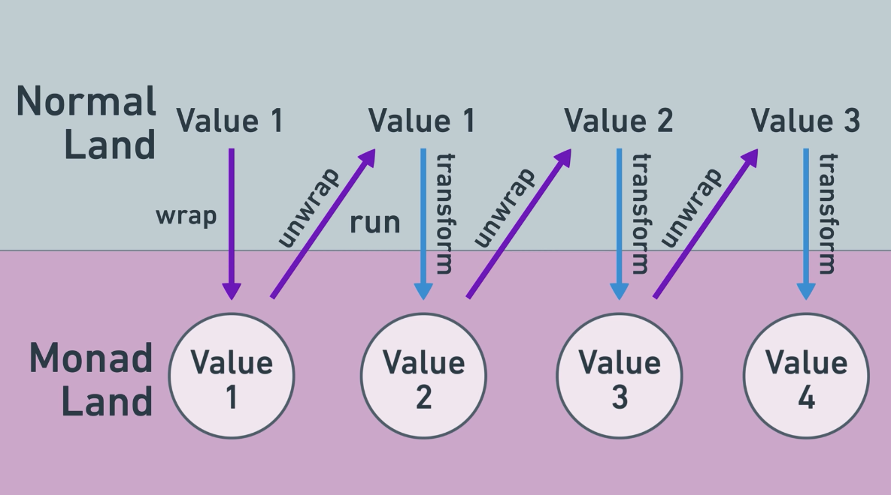

# Monads

This directory explains how monads work, how can they be approached and includes some examples.

Monads are a design pattern that allows a user to chain operations while the monad manages the secret work behind the scenes.

They wrap their return values as a monadic type. Although th computation is permormed on actual of the variable, the wrapFunctions, runFunctions and transformFunctions all return monadic types.

## 3 Components of Monads:

### 1. Wrapper Type

Define an interface (type) for the Monad  
You can use a field called value for the result, it can be any type such as number of string  
If you want to use a specific unknown type, you can use generics <T>  
You can add other necessary fields such as logs or other values

### 2. Wrap Function

Allows entry to monad ecosystem.  
They take the expected value and returns the monadic value.

They are also known as return, pure, unit...

### 3. Run Function

Runs transformations on monadic values.

They generally take two main arguments.

- The input as the monadic value
- The transform function (callback function)

Transform functions are the functions that makes the logic taking the actual values as input and returning a monadic value.

Run functions converts the monadic value from input to actual value, performs some operation and returns a monadic value.

They are also known as bind, >>=, flatMap...

## Notes

Wrap function provides an entry point converting the actual input to monadic value  
Run functions use transform functions (callbacks) and always returns monadic values  
Therefore, they are suitable for chain operations which decreases other function calls  
At the end, the actual value can be taken out from the monadic value

